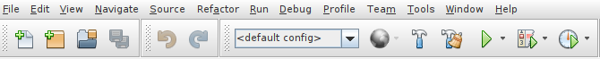

<h1 align="center">Trabalho Java</h1>

<h1>Resumo</h1>

Este sistema foi escrito inteiramente na linguagem java, utilizando a IDE NetBeans e o sistema operacional linux, distro linux mint, a versão JDK que eu utilizo neste projeto é o JDK 11. Esse sistema simula um sistema de caixa eletrônico, onde você pode cadastrar 3 tipos de contas, uma conta comum, uma poupança e uma conta especial, ao realizar o cadastro, você pode escolher quais operações deseja realizar, se você deseja sacar, depositar, transferir, reajustar, verificar o saldo ou sair do sistema.

<h2>Como Rodar o Código</h2>

Ao realizar o download do pacote, ele vira em uma pasta zipada, então você terá que extrair o pacote em sua máquina, escolha o diretório (pasta) de sua preferência. Ao extrair a pasta, ela virá com o nome "TrabalhoJava", então siga as instruções a baixo:

Abra o projeto na IDE NetBeans, para isso, clique com o botão direito do mouse em cima da pasta, então vai aparecer uma telinha com várias opções
clique em "Abrir como", então você escolhe o programa NetBeans, se você tiver, se não, pode abir em outra IDE de sua preferência, então o projeto "TrabalhoJava" abrirá.

Ao abrir o projeto, dentro da pasta "Source Packages" você encontra o package "Trabalho1", e nele vão ter 10 arquivos .java, 6 arquivos formam o frontend do sistema de caixa bancário, feitos com JFrame, e 4 formam o banckend.

Para ver o sistema rodando existem algumas formas, lembrando que eu estou explicando como ocorre no NetBeans.

<h1>Passo a Passo</h1>

Primeiramente você verifica se nenhum dos pacotes quebraram, depois você se dirige ao menu do NetBeans, e procura a aba "Run" ou pode ser que o seu netbeans esteja em português, esta aba estará como "Rodar" ou mesmo "executar", ao clicar nesta aba, você vai clicar em "Run Project" ou em português "Executar Projeto".

Ao clicar em run project, uma tela de boas vindas vai se abrir, mais a baixo terá um botão de "OK", clicando nele, você encontrará, uma tela de cadastro, onde você poderá cadastar 3 tipos de contas:

- Conta Comum, onde você terá que cadastrar o nome do titular da conta, o número da conta e o saldo inicial.

- Conta Poupança, você terá que cadastrar o nome do titular da conta, o número da conta, o saldo inicial e a porcentagem do   reajuste que você deseja realizar na conta, basta por o número em decimal, para ele guardar no sistema.

- Conta Especial, está é uma conta que pode ser tratada como uma conta de crédito, na qual você terá que cadastrar o nome do titular, o número da conta, o slado inicial, o limite da conta, e a multa que irá ser tarifada pelo uso dela.

Ao clicar no botão "cadastrar", se você tiver preenchido todos os campos você conseguirá acessar o menu de operações, caso não tenha preenchido, aparecerá uma mensagem de falha, pedindo para que vocẽ preencha esses campos, com uma única exeção, do campo de "reajuste" da conta poupança, pois o sistema está programado para preencher esse reajuste aumáticamente, caso o cliente não deseje preencher.

Acessando o menu, você terá acesso a 5 botões operação e um botão de saída, caso deseje sair do sistema. Você encontrará os botões de saque, depósito, trasferência, reajuste, ver saldo, caso deseje verificar o seu saldo, e o botão sair, explicado a cima. 

